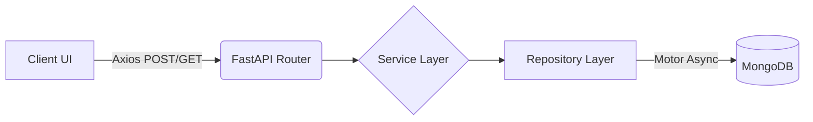

# WhatsApp-Style Quiz Application


A production-grade, mobile-first full-stack Quiz Application designed to look and feel like a modern chat interface (inspired by WhatsApp). Built with React, Vite, FastAPI, and MongoDB.

## Features
- **WhatsApp-inspired UI**: Chat bubble styled questions, sticky bottom answer sheets, and typing animations (`...`).
- **Smooth Animations**: Powered by Framer Motion for premium route transitions and micro-interactions.
- **State Persistence**: Zustand + LocalStorage ensures users never lose their quiz progress on refresh.
- **Real-time Analytics**: Aggregation pipelines calculating DAU, WAU, completion rates, and average response times.
- **Scalable Architecture**: FastAPI Repository Pattern enforcing strict separation of concerns.
- **Dockerized**: One-command `docker compose up` orchestration.

## Tech Stack
- **Frontend**: React 18, Vite, React Router DOM, Zustand, Framer Motion, Recharts, Axios, Vanilla CSS (CSS Modules style).
- **Backend**: Python 3.11, FastAPI, Uvicorn, Motor (Async MongoDB), Pydantic.
- **Database**: MongoDB.
- **DevOps**: Docker, Docker Compose.

## Architecture Flow


## Folder Structure
```text
skillbytes/
├── backend/
│   ├── app/
│   │   ├── core/           # Config & DB connection
│   │   ├── middleware/     # Global exception handlers
│   │   ├── repositories/   # MongoDB abstractions
│   │   ├── routes/         # API Controllers
│   │   ├── schemas/        # Pydantic models
│   │   ├── services/       # Business logic (Analytics, Quiz)
│   │   └── scripts/        # Database seeders
│   ├── Dockerfile
│   └── requirements.txt
├── frontend/
│   ├── src/
│   │   ├── pages/          # Dashboard, QuizSession, Analytics
│   │   ├── services/       # Axios API layer
│   │   ├── store/          # Zustand global state
│   │   └── styles/         # Global WhatsApp CSS
│   ├── Dockerfile
│   └── package.json
└── docker-compose.yml
```

## Setup & Local Development

### 1. Environment Variables
Create `.env` files based on the provided `.env.example` templates in both `backend` and `frontend` directories.

### 2. Running via Docker (Recommended)
Make sure Docker Desktop is running.
```bash
docker compose up --build -d
```
- Frontend will be available at `http://localhost:5173`
- Backend API will be available at `http://localhost:8000`
- API Docs (Swagger) at `http://localhost:8000/docs`

### 3. Database Seeding
To populate the database with sample system design questions:
```bash
docker exec -it quiz_backend python app/scripts/seed.py
```

## Deployment Guide
This architecture is optimized for cloud deployment.
- **Frontend (Vercel/Netlify)**: Point the build command to `npm run build` and output directory to `dist`. Set `VITE_API_BASE_URL` to your backend URL.
- **Backend (Render/Railway)**: Use the provided `Dockerfile` or run `uvicorn app.main:app --host 0.0.0.0 --port $PORT`.
- **Database (MongoDB Atlas)**: Provision a free cluster and update the backend's `MONGODB_URL`.

## Loom Walkthrough
[Placeholder for Loom Video Link]

## Future Improvements
- User Authentication (JWT)
- Real-time WebSockets for live leaderboards
- Image/Video support in chat questions
